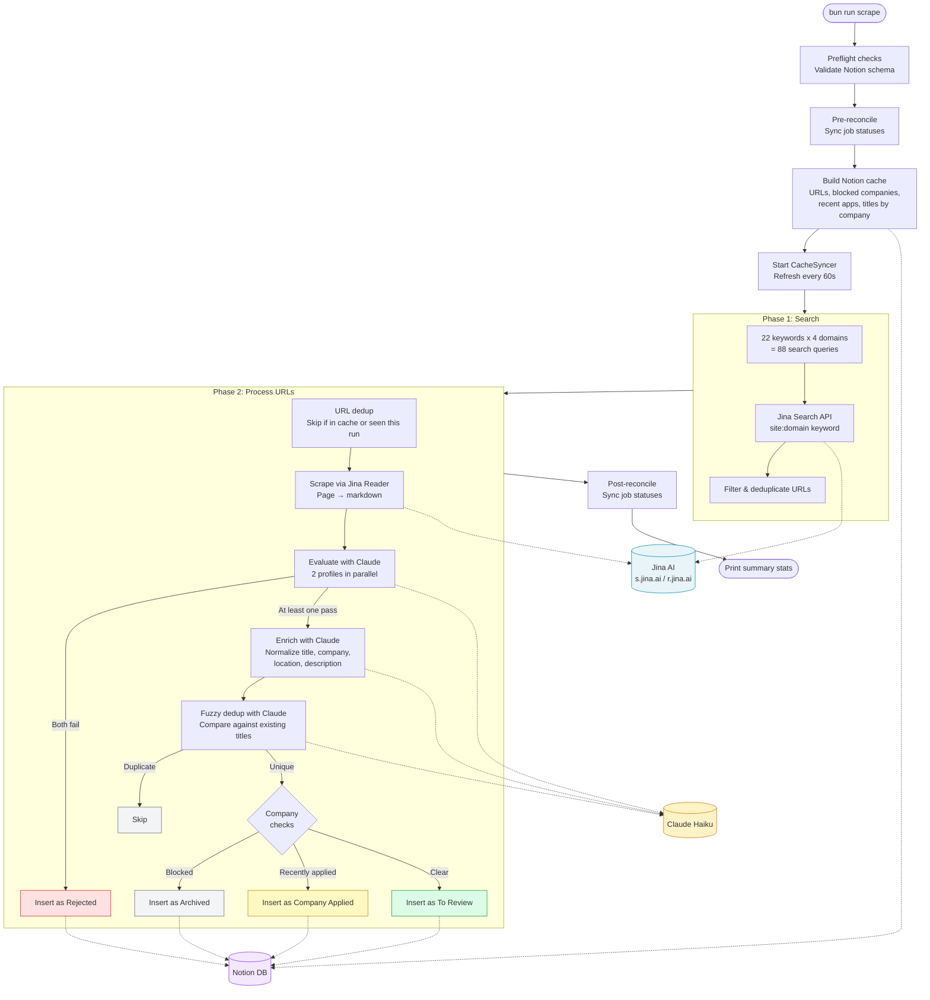

# jobfinder

Automated job search and enrichment pipeline for crypto/web3 engineering positions. Searches job boards (Ashby, Lever, Greenhouse, Workable), evaluates listings with Claude, and stores qualified jobs in Notion.

## Architecture



Each external service call is wrapped in a resilience stack: **semaphore** (concurrency limit) → **circuit breaker** (5 failures → 30s cooldown) → **retry** (3 attempts, exponential backoff on 429/5xx).

| Service | Concurrency | Rate limit |
|---------|-------------|------------|
| Jina Search | 5 parallel | — |
| Jina Reader | 8 parallel | — |
| Claude | 10 parallel | — |
| Notion | 3 parallel | 3 req/s (token bucket) |

## How Search Works

Each run generates search queries by combining **keywords** (e.g. `senior backend engineer crypto`, `lead fullstack engineer defi`) with **job board domains** (Ashby, Lever, Greenhouse, Workable).

The query format is `site:{domain} {keyword}` — for example:

```
site:jobs.ashbyhq.com senior backend engineer crypto
site:jobs.lever.co senior fullstack engineer web3
```

These queries hit the [Jina Search API](https://s.jina.ai) which returns indexed job listing URLs. Results are filtered to keep only valid job page URLs and deduplicated across all queries before moving to Phase 2.

## How URL Processing Works

Each URL goes through a multi-stage pipeline:

1. **Dedup** — skip immediately if the URL exists in the Notion cache (fetched at startup) or was already seen in this run
2. **Scrape** — the [Jina Reader API](https://r.jina.ai) fetches the page and converts it to clean markdown (title, company, description, dates)
3. **Evaluate** — Claude Haiku runs **two evaluation profiles in parallel** (crypto/web3 and fintech/trading infrastructure). The LLM acts as a binary gatekeeper — pass or fail — not a scorer. If both profiles reject the job, it's inserted as "Rejected" and processing stops
4. **Enrich** — Claude Haiku normalizes the raw scraped data: cleans the title (removes company/location suffixes), proper-cases the company name, normalizes the location (e.g. `Remote - US/EU` → `Remote (US/EU)`), and rewrites the description as concise markdown
5. **Fuzzy dedup** — if the company already has jobs in the cache, Claude Haiku compares the new title against existing ones to catch duplicates that differ only in abbreviations, reordering, or trivial additions
6. **Company checks** — skip if the company is marked "Company Blocked", or insert as "Company Applied" if the user recently applied there (within 6 months)
7. **Insert** — write to Notion with status "To Review"

A `CacheSyncer` runs in the background, refreshing the Notion cache every 60 seconds and merging local additions so that jobs inserted mid-run are visible for dedup.

## Job Statuses

| Status | Set by | Meaning |
|--------|--------|---------|
| `To Review` | System | New job, needs human review |
| `Applied` | User/System | Applied to this job (auto-set if Application Date is filled) |
| `Skipped` | User | Job isn't a fit, but company is fine |
| `Rejected` | System | LLM evaluation rejected this job |
| `Company Applied` | System | Another job at this company was applied to recently |
| `Company Blocked` | User | Company is not a fit (e.g., not remote EU) |
| `Archived` | System/User | Done with this listing |

## Reconciliation

Reconciliation is an idempotent 4-pass process that keeps job statuses consistent with the current state of the Notion database. It runs **both before and after scraping** — before to clean up stale state from manual edits between runs, and after to propagate statuses for newly inserted jobs.

The goal is to keep the Notion board accurate without manual status management. The user only needs to fill in Application Date or set Company Blocked — everything else propagates automatically.

**Pass 0 — Auto-mark Applied**: Any job with an Application Date filled but status other than "Applied" gets corrected. This means you just need to fill in the date — the status updates itself.

**Pass 1 — Unstale Company Applied**: Jobs marked "Company Applied" within the last 30 days are checked against the 6-month application lookback window. If the original application is now older than 6 months, the job is moved back to "To Review" so it gets a fresh look.

**Pass 2 — Propagate Company Applied**: Finds all companies where the user has an Application Date within the last 6 months, then marks any "To Review" jobs from those companies as "Company Applied". This prevents reviewing jobs at companies you've already applied to recently.

**Pass 3 — Archive blocked companies**: Finds all companies with at least one "Company Blocked" job, then archives any "To Review" jobs from those companies. Once you block a company, all future scraped jobs from them are automatically archived.

## Local Setup

```bash
bun install
cp .env.example .env  # fill in your API keys
bun run scrape
```

## Deploy to Railway (Cron Job)

1. Create a new project on [railway.app](https://railway.app) and connect your GitHub repo
2. Railway auto-detects the `Dockerfile` and builds from it
3. In the service's **Variables** tab, add:
   - `NOTION_TOKEN`
   - `NOTION_DATABASE_ID`
   - `JINA_API_KEY`
   - `ANTHROPIC_API_KEY`
4. In **Settings**, change the service type to **Cron Job**
5. Set the cron schedule to `0 8 */2 * *` (every 2 days at 8 AM UTC)
6. Increase the job timeout to **45 minutes** (the scraper can take 10-30+ min depending on results)

## Testing

```bash
bun test
```
